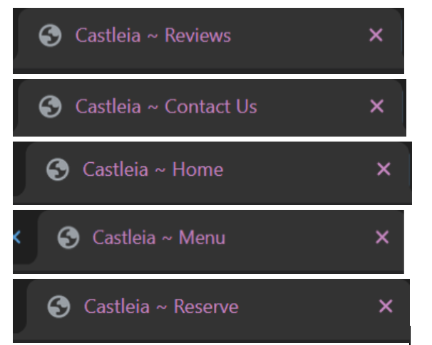
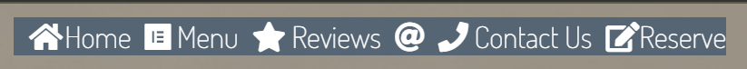
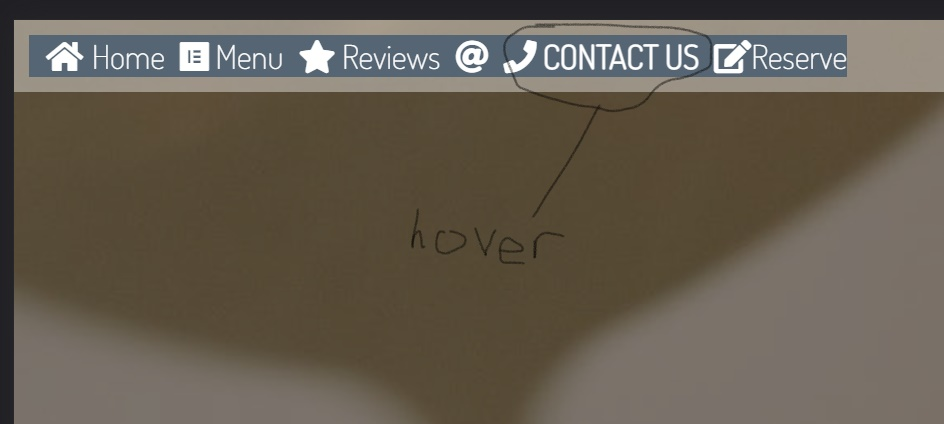
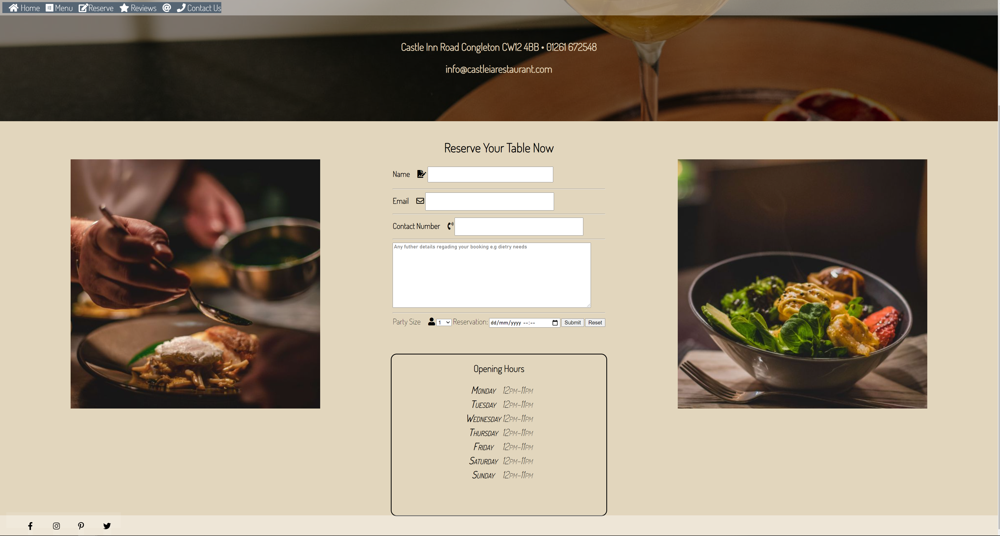

# Castleia 
Castleia is a restaurant that I have plucked out of thin air, to make this restaurant a reality I have created a user-friendly website. As Castlia is a professional place to visit I wanted to create a sleek, smart and professional layout to match the quality.  

## Project Aims 
Before even thinking about what HTML and CSS I was going to be using I needed to think of a few items:
1. Business type
2. Target Audience
3. Site Aims 
4. Color Scheme 
5. Navigation

### Business Type 
- Restaurant, I chose to go down the restaurant path purely because I've been in the hospitality industry for 7 years myself and chose this giving myself the advantage of content for the site. 
- As I said being in the industry I know what the competition is, I know what the users what and desire on a restaurants site 
- Customers expect, simple but yet elegancy, the better looking and organised website the higher the chance of them getting a better experience at the venue
### Target Audience
- My target audience is quite broad from; families to businesses and groups of friends, the easier the interaction and navigation the longer the user will choose to stay on the site and be more likely to return and book a table and if not to share to their peers. 
- Users that are looking for a new place to dine out who just want to see what information they need ie; booking a table, seeing the menu without having to complete a maze to find and all the needed information to get in touch if need be or even find us on a map. 

### Site Aims 
- When creating my site I wanted users to be aesthetically pleased
- I wanted the customer to not be confused and redirect to another restaurant site
- To offer the user an easy to navigate and accessible experience across whatever device they desire to use 
### Color Scheme 
 - When deciding the color scheme I wanted to make the site look smart and fresh as well as professional, to do this I stuck to two main colors one of which is #e2d6bd as the background and #F5F5F5. The navbar color has changed over the cause of time as you can see in the below screenshots, but I've gone with RGB(255, 255, 255, 0.4) to make it easier to identify across each device. 
### Meta Description and Title 
- When deciding what description to give the page I used [Smart Copy](https://unbounce.com/product/smart-copy/?gclid=Cj0KCQiA-eeMBhCpARIsAAZfxZCUAoiSbSXIyGfYcJGbYaeFRR6PMR4r1QzC_kqyJhuPF2Mxeda07iEaAqj0EALw_wcB) to generate a meaningful description. 
- The title of the page is a simple feature but I wanted to make it mine, so for each page, I used the title of the page within the title so the user can see what page they are on within the tab bar. 

## Features that are used across the site
To keep the professionalism of the site I kept certain features the same across each page this also makes navigating around easier for the user. 

  **Nav Bar** 
---
The Navbar appears on all pages, it has interactive links to all pages, home, menu, contact us and review. To make the user understand which page they are currently on I used a class of "active" to change the background color of the active page. To add to the user experience I implemented a :hover function, so when the user hovers over each page the background color is changed. For the media query of (Max-width: 620px;) I removed the :hover function so the hero image text was overlapped with the background color.
Update - 16/11/2021 I have made the navbar have a bigger font and changed the text color to make the contrast better when the user is scrolling.

---
Throughout testing and hearing feedback I learned that my nav bar color scheme wasn't very user friendly and didn't contrast so well, I needed a new navbar so below I will display it. 

After twiddling and adjusting my navbar I found a contrast that worked for all devices to make the navbar keep the professional feel and look. When users are using a desktop with the hover function it looks like such: 

 

  **Hero Image** 
---
The hero image is shown at the top of each page (below the nav), by continuing to show the hero image across each page it creates a familiar feel for the user and reminds them of which restaurant they're visiting. To further increase the user experience I have placed text within the hero image which is sat on top, the information within this text makes it possible for the user to have all info on one page if needs be. Upon loading into each page the hero image has a zoom effect, to essentially show off the brand of which is Castleia and force them to notice it and its surrounding elements.
  
   

**Footer**
---
I placed the footer at the bottom of my site mirrored with the navbar to keep consistency across all pages, I used only icons for the footer, Facebook, Twitter, Instagram and Pinterest, again all icons were taken from Font awesome. I made a hover effect for these icons with text and box shadows 

`code` 
 .footer-main :hover {
    font-size: 40px;
    color: #e2d6bd;
    box-shadow: 0 0 5px #e2d6bd;
    text-shadow: 0 0 5px black;
} 

## Icons and Font use 
Across the site I have used two fonts:
 -  Source Code Pro  [Google fonts](https://fonts.google.com/)
 -  Dosis [Google fonts](https://fonts.google.com/)
I used these two fonts as they compliment each other quite well and keep to my style of simple, professional and elegant. 
All of the fonts I used were sourced from Google Fonts.

Across the site, I used many icons to make the site work for all audiences as well as make navigation easier. 
All icons I used were from Font Awesome. [FontAwesome](https://fontawesome.com/)

# Individual Page Content

## Home Page content
- As this is the first page the user loads into I needed to make it look classy and appealing. 
- I typed up phrases to make the customer feel good, I also used capitalization on the word "you" to grab the users attention and involve them within the site.
- I've included three separate images to catch the users attention by making them bright and related to the content written above, I used style to have them all line up next to each other with the same zoom effect that I used on the hero image.
 

## Menu Page
- The layout of this page was crucial, although it isn't packed with images, videos and links, the purpose of the site entirety is to get the customers falling in love with the food. To make them purely fall in love with food, I've centred the entire menu and made it easier to read with different header elements. 
- This page also uses icons to display that different dietary needs are met, making the site more applicable for a wider range of the user.
- To help the user navigate to the opening hours section of the site I created a image with a link to the appropiate site page.

## Review Page
- On this page I made the content read left to right so the user is drawn to fill in the review form. 
- I used placeholders for each form input type to make the user experience easier. 
- Each field is requested to put a stop to false information being input. 
- To make the page feel more real I used an "onclick" command to show the review had been accepted. I used [W3 School](https://www.w3schools.com/html/tryit.asp?filename=tryhtml_input_button) to help me to do this. I have shown this in the below screenshot

## Contact Page
- The contact page is one of my favourites because I got to use a variation of different code, such as "Display - Padding - Vertical Align" using many CSS styles allowed me to understand how they all worked, improving my knowledge. 
- I created three smart looking, simple effective boxes with relevant information regarding different ways to help the user. 
- Below my helpful boxes I used a form with the use of (name - input) (email - input) (email - input) and a (textarea) again using an onclick command with a relevant popup. I decided to have this form in a horizontal position so the user can locate the google map which I included inside an iframe. 
- The iframe I used on this page was a link from google maps, as Castleia isn't a real location I used the destination of my old workplace with a similar name. 

## Reserve Page 
- I created this page with the idea of focus on the reserve form I did this by placing images either side and the form in the center. 
- Also displayed on the page is the opening hours of the restaurant which is also available on the home page with a hyperlink. 
- I used a form with multiple input types to show my understanding of each element such as 
- `code` <option> <name> <number> <email> <textarea> 

