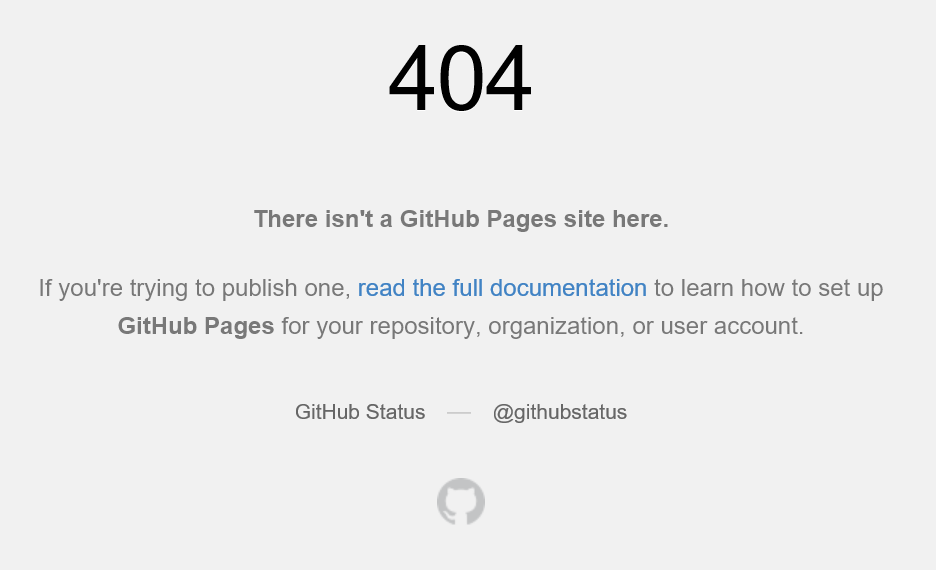
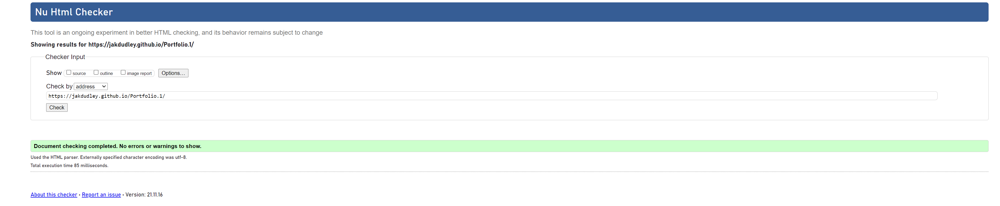
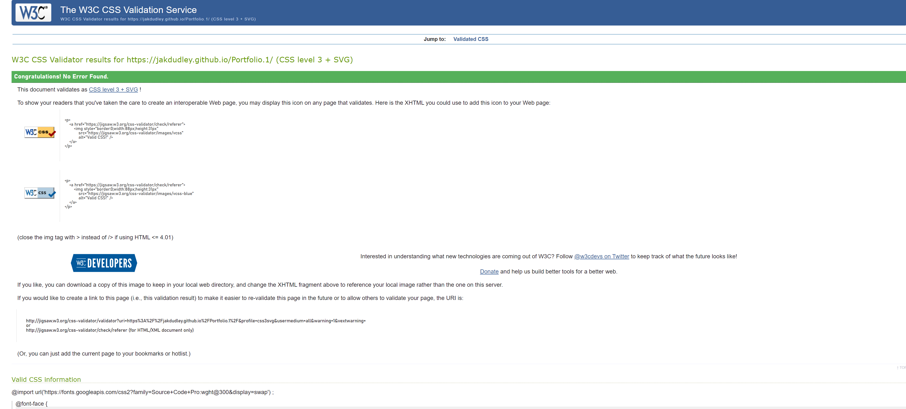

# Testing 
After completion of my site I conducted testing within different browsers .
- Chrome
- Firefox 
- Internet Explorer 
- Microsoft Edge 

## Browsers 
- Chrome 
  - I used chrome for the development of my site and did all testing on this browser as i went along. 
- Firefox 
  - To test the site on Firefox i used the site within the dev tools to make sure it was responsive across all devices. No issues were found.
- IE 
  - Dev tools was also used within IE to check the capablities of the site. No issues were found.
- Microsoft Edge 
  - No issues found. 

Across Firefox, IE and Edge i ran into an error; When clicking on the image with the link to the reserve page i got the below; 
- To fix this issue i asked the Slack community but i am yet to hear any fix or reason for this message. 
 

## Independent Testing 
To have the best feedback possible i asked a few friends to use the site as if they were a customer and give me there opinions and any bugs they came across. 

# Validator 
To validate my HTML I used [W3C](https://validator.w3.org/) 

To validate my CSS I used [W3C](https://jigsaw.w3.org/css-validator/)

[CSS validate sticker](https://jigsaw.w3.org/css-validator/check/referer)

    