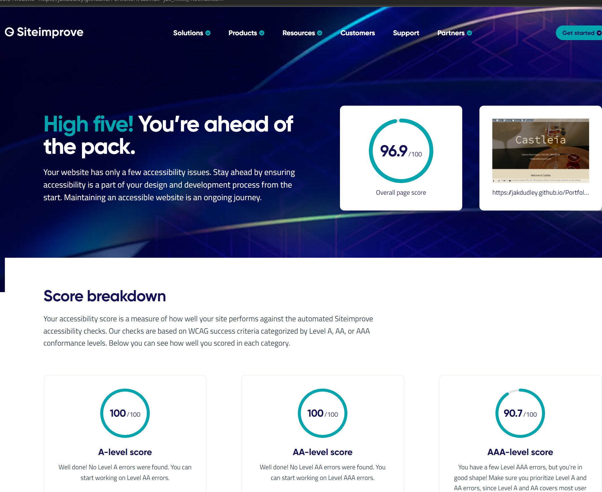

# Testing 
After the completion of my site, I conducted testing within different browsers.
- Chrome
- Firefox 
- Internet Explorer 
- Microsoft Edge 

## Browsers 
- Chrome 
  - I used chrome for the development of my site and did all testing on this browser as I went along. 
- Firefox 
  - To test the site on Firefox I used the site within the dev tools to make sure it was responsive across all devices. No issues were found.
- IE 
  - Dev tools were also used within IE to check the capabilities of the site. No issues were found.
- Microsoft Edge 
  - No issues were found. 

Across Firefox, IE and Edge I ran into an error; When clicking on the image with the link to the reserve page I got the below; 
- To fix this issue I asked the Slack community but I am yet to hear any fix or reason for this message. 
 
- I later found a fix for this error, I needed to link the page to the deployed site instead of reserve.html.  

## Independent Testing 
To have the best feedback possible I asked a good friend of mine who uses a selection of browsers and sites daily to use the site as if they were a customer and give me their opinions and any bugs they came across. 

To further improve testing, I used the website myself and put myself in the users' shoes. I tested all the forms across the site to check they could be typed in with the particular values. I also used the map to see if I was able to move around and check the iframe worked correctly. 

# Validator 
To validate my HTML I used [W3C](https://validator.w3.org/) 

To validate my CSS I used [W3C](https://jigsaw.w3.org/css-validator/)

## DEV tools
Once I finished the design of the page I wanted to check the CSS to ensure there was no unused code. To do this I opened DEV tools and manually deleted code to see if it was in use, I compiled a list of code that wasn't in use I went back into my CSS stylesheet and deleted unused code, this helped clear up the page and add comments to each section of CSS. 
To improve my understanding and target certain elements I created a rule to change background-color: yellow; doing this made seeing each element easier so I knew what I needed to change and adjust in my main CSS. 

# Lighthouse 
I completed lighthouse audits in incognito mode to ensure any chrome extensions didn't interfere with the report.
To guarantee the most accessibility across all pages I ran audits for each page for both desktop and mobile. 

## Lighthouse Reports
The below screenshots are for lighthouse reports for desktop but when I ran them for mobile they were the same or a little higher, I've chosen to display the desktop reports and lowest to show how I repaired them to increase the report. 
--- 

**Home Page**

**Menu Page**

**Reserve Page Before & After**

  - I read through the report and made changes to ARIA ids along with removing an aria label from the navbar. 

**Review Page** 

**Contact Page Before & After**

  - After going through the report I needed to make the ID's in the form input titles unique, instead of going through each and making new values for them I created a class making it easier to target them within the CSS stylesheet.

As well as using lighthouse I found another [Independent Accessibility Checker](https://www.siteimprove.com/) to further improve my understanding of the accessibility of my website. 

After checking and going through all of the reports and editing on Dev Tools I feel much more comfortable and confident using HTML and CSS. On making my next project I will have a head start in making the site more accessible from the start thus ensuring I have more time to perfect the project and less time going over elements, of course still conducting regular tests.

# Changes Along the Way 
Throughout the course of my project, I made decisions that affected the way the website runs and displays now as a finished project. 
- On each of the forms I originally used a code from [W3](https://www.w3schools.com/html/tryit.asp?filename=tryhtml_input_button) But after testing this feature out I realised that it did not clear the form like a submit button would. If my knowledge of JavaScript was better I would have kept this in but to keep my site as realistic and functional as possible I decided to stick with a simple submit type. 
- When I started the project there were only in fact three pages, Home, Reviews and menu. Booking a table was on the home page as I wanted to force this upon the user, but it was pointed out to me by peers and fellow students that when they visited the site for the first time it didn't feel like they were on a home page and often tried refreshing the page. After hearing this feedback I decided to make the reserve page. By doing this I made an additional page that is now fully functional and created the home page we see today, with a simple paragraph and some images it quickly became a much better feeling site. 
- The forms on media queries, at first I created the site for desktop and when it came to the forms for smaller devices it massively deformed the screen, so I took the initiative to create forms for smaller screens and displaying them as hidden, I found this to work effectively and also improved my ability in CSS. 

 [Back to README](/README.md) 

    